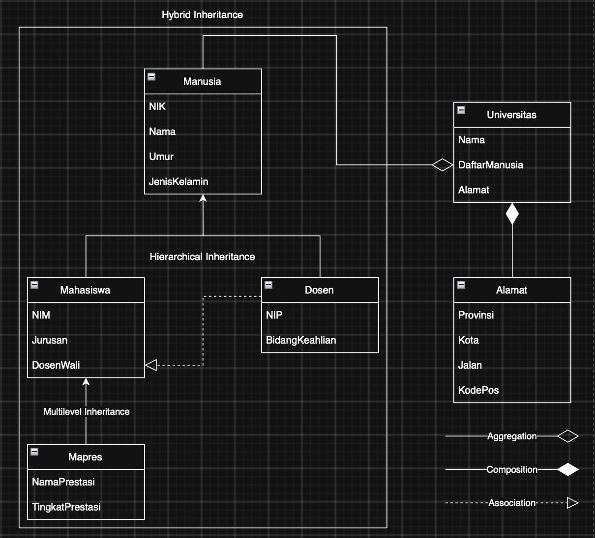

# Janji
Saya Muhammad Dzaka Indrianto dengan NIM 2508755 mengerjakan Tugas Praktikum 1 dalam mata kuliah Desain dan Pemrograman Berorientasi Objek untuk keberkahanNya maka saya tidak melakukan kecurangan seperti yang telah dispesifikasikan. Aamiin.

# Struktur File

Program dibuat dalam tiga bahasa pemrograman, yaitu Python, Java, dan C++. Ketiga implementasi menggunakan desain kelas dan konsep OOP yang sama.

```text
├── Python/
│   ├── Program/
│   │   ├── alamat.py
│   │   ├── dosen.py
│   │   ├── mahasiswa.py
│   │   ├── main.py
│   │   ├── manusia.py
│   │   ├── mapres.py
│   │   └── universitas.py
│   │
│   └── Dokumentasi/
│       ├── DesainRelasi.png
│       ├── ErrorHandlingJurusanKosong.png
│       ├── ErrorHandlingMenuCharacter.png
│       ├── ErrorHandlingMenuDiluarPilihan.png
│       ├── ErrorHandlingNIKchar.png
│       ├── ErrorHandlingNIKkosong.png
│       ├── ErrorHandlingNIMchar.png
│       ├── ErrorHandlingNIPchar.png
│       ├── ErrorHandlingNamaKosong.png
│       ├── ErrorHandlingPrestasiKosong.png
│       ├── ErrorHandlingTambahMapresTanpaDosen.png
│       ├── ErrorHandlingUmur<1.png
│       ├── ErrorHandlingUmur>120.png
│       ├── ErrorHandlingUmurchar.png
│       ├── ErrorHandlngTambahMahasiswaTanpaDosen.png
│       ├── ErrorPilihDosWalchar&tidakada.png
│       ├── HasilInputDosen.png
│       ├── HasilInputMahasiswa.png
│       ├── HasilInputMapres.png
│       └── OutputMenuOpsi4.png
│
├── Java/
│   ├── Program/
│   │   ├── Alamat.java
│   │   ├── Dosen.java
│   │   ├── Mahasiswa.java
│   │   ├── Main.java
│   │   ├── Manusia.java
│   │   ├── Mapres.java
│   │   └── Universitas.java
│   │
│   └── Dokumentasi/
│       ├── DesainRelasi.png
│       ├── ErrorHandlingJurusanKosong.png
│       ├── ErrorHandlingMenuCharacter.png
│       ├── ErrorHandlingMenuDiluarPilihan.png
│       ├── ErrorHandlingNIKchar.png
│       ├── ErrorHandlingNIKkosong.png
│       ├── ErrorHandlingNIMchar.png
│       ├── ErrorHandlingNIPchar.png
│       ├── ErrorHandlingNamaKosong.png
│       ├── ErrorHandlingPrestasiKosong.png
│       ├── ErrorHandlingTambahMapresTanpaDosen.png
│       ├── ErrorHandlingUmur<1.png
│       ├── ErrorHandlingUmur>120.png
│       ├── ErrorHandlingUmurchar.png
│       ├── ErrorHandlngTambahMahasiswaTanpaDosen.png
│       ├── ErrorPilihDosWalchar&tidakada.png
│       ├── HasilInputDosen.png
│       ├── HasilInputMahasiswa.png
│       ├── HasilInputMapres.png
│       └── OutputMenuOpsi4.png
│
└── CPP/
    ├── Program/
    │   ├── Alamat.cpp
    │   ├── Dosen.cpp
    │   ├── Mahasiswa.cpp
    │   ├── Main.cpp
    │   ├── Manusia.cpp
    │   ├── Mapres.cpp
    │   └── Universitas.cpp
    │
    └── Dokumentasi/
        ├── DesainRelasi.png
        ├── ErrorHandlingJurusanKosong.png
        ├── ErrorHandlingMenuCharacter.png
        ├── ErrorHandlingMenuDiluarPilihan.png
        ├── ErrorHandlingNIKchar.png
        ├── ErrorHandlingNIKkosong.png
        ├── ErrorHandlingNIMchar.png
        ├── ErrorHandlingNIPchar.png
        ├── ErrorHandlingNamaKosong.png
        ├── ErrorHandlingPrestasiKosong.png
        ├── ErrorHandlingTambahMapresTanpaDosen.png
        ├── ErrorHandlingUmur<1.png
        ├── ErrorHandlingUmur>120.png
        ├── ErrorHandlingUmurchar.png
        ├── ErrorHandlngTambahMahasiswaTanpaDosen.png
        ├── ErrorPilihDosWalchar&tidakada.png
        ├── HasilInputDosen.png
        ├── HasilInputMahasiswa.png
        ├── HasilInputMapres.png
        └── OutputMenuOpsi4.png
```

### Struktur Kelas

| Kelas | Fungsi |
|---|---|
| `Manusia` | Kelas dasar yang menyimpan atribut umum manusia seperti NIK, nama, umur, dan jenis kelamin. |
| `Dosen` | Turunan langsung dari `Manusia` yang memiliki atribut NIP dan bidang keahlian. |
| `Mahasiswa` | Turunan langsung dari `Manusia` yang memiliki NIM, jurusan, dan dosen wali. |
| `Mapres` | Turunan dari `Mahasiswa` yang menambahkan nama prestasi dan tingkat prestasi. |
| `Alamat` | Menyimpan data alamat universitas. |
| `Universitas` | Menyimpan nama universitas, alamat, serta daftar anggota universitas. |
| `Main` / `main.py` | Menjadi titik masuk program, menu interaktif, input data, dan validasi input. |

# Desain Relasi

## Penjelasan Desain

Desain program menggunakan beberapa konsep utama dalam pemrograman berorientasi objek, yaitu **inheritance, composition, aggregation, association,** dan **polimorfisme**.

### 1. Hierarchical Inheritance

`Manusia` merupakan superclass yang memiliki dua subclass langsung, yaitu `Mahasiswa` dan `Dosen` alasan saya memilih ini karena saya akan menggabungkannya dengan multilevel inheritance dibawah mahasiswa nanti untuk membuat hybrid inheritance. 

```text
        Manusia
        /     \
       /       \
Mahasiswa     Dosen
```

Hal ini disebut **hierarchical inheritance** karena satu superclass memiliki lebih dari satu subclass.

Class `Manusia` menyimpan atribut yang bersifat umum:

- NIK
- Nama
- Umur
- Jenis Kelamin

Kemudian atribut tersebut diwariskan kepada `Mahasiswa` dan `Dosen`.

`Dosen` menambahkan atribut:

- NIP
- Bidang Keahlian

Sedangkan `Mahasiswa` menambahkan atribut:

- NIM
- Jurusan
- Dosen Wali

### 2. Multilevel Inheritance

`Mapres` merupakan subclass dari `Mahasiswa`.

```text
Manusia
   |
Mahasiswa
   |
 Mapres
```

Karena `Mapres` mewarisi `Mahasiswa`, sedangkan `Mahasiswa` sendiri mewarisi `Manusia`, maka terbentuk **multilevel inheritance**.

`Mapres` mendapatkan atribut dari `Mahasiswa` sekaligus atribut dari `Manusia`, kemudian menambahkan atribut khusus:

- Nama Prestasi
- Tingkat Prestasi

### 3. Hybrid Inheritance

Program merupakan gabungan dari **hierarchical inheritance** dan **multilevel inheritance**.

Strukturnya adalah:

```text
              Manusia
             /       \
            /         \
     Mahasiswa       Dosen
         |
       Mapres
```

Gabungan pola tersebut menghasilkan **hybrid inheritance**.

### 4. Composition antara Universitas dan Alamat

`Universitas` memiliki objek `Alamat` sebagai bagian dari dirinya.

```text
Universitas ◆──── Alamat
```

Relasi ini merupakan **composition** karena objek `Alamat` dibuat di dalam constructor `Universitas`.

Pada program, struktur `Universitas` terdiri dari:

```text
Universitas
├── Nama
├── Alamat
└── Daftar Manusia
```

`Alamat` memiliki data:

- Provinsi
- Kota
- Jalan
- Kode Pos

Objek `Alamat` dibuat bersamaan ketika objek `Universitas` dibuat, sehingga `Alamat` merupakan bagian internal dari `Universitas`.

### 5. Aggregation antara Universitas dan Manusia

`Universitas` memiliki daftar anggota yang dapat berisi objek `Dosen`, `Mahasiswa`, maupun `Mapres`.

```text
Universitas ◇──── Manusia
```

Relasi ini merupakan **aggregation**.

Objek manusia dibuat terlebih dahulu di luar `Universitas`, kemudian referensinya dimasukkan ke dalam daftar anggota universitas.

Pada program digunakan:

```text
daftar_manusia
```

Daftar tersebut dapat menyimpan berbagai objek turunan dari `Manusia`.

Pada Python digunakan `list`, pada Java digunakan `List<Manusia>`, sedangkan pada C++ digunakan `vector<Manusia*>`.

Dengan demikian, `Universitas` hanya menyimpan referensi/pointer terhadap objek yang sudah dibuat dan tidak membuat objek `Dosen`, `Mahasiswa`, atau `Mapres` tersebut di dalam dirinya.

### 6. Association antara Mahasiswa dan Dosen

`Mahasiswa` memiliki hubungan dengan `Dosen` melalui atribut `dosen_wali`.

```text
Mahasiswa - - - - - > Dosen
```

Relasi ini merupakan **association** karena `Mahasiswa` hanya memiliki referensi kepada `Dosen` yang sudah ada.

Satu Mahasiswa wajib memiliki tepat satu dosen wali, sedangkan satu Dosen dapat menjadi dosen wali bagi banyak Mahasiswa.

```text
Dosen 1 -------- 0..* Mahasiswa
                    |
                    | setiap Mahasiswa
                    | wajib memiliki
                    | tepat 1 Dosen Wali
```

Relasi tersebut bukan composition karena Dosen tidak dibuat dan tidak dimiliki oleh Mahasiswa. Dosen tetap dapat berdiri sendiri dan dapat digunakan oleh beberapa Mahasiswa.

Pada constructor `Mahasiswa`, dosen wali juga diwajibkan untuk tersedia.

Python melakukan pengecekan terhadap `None`, Java menggunakan `Objects.requireNonNull()`, sedangkan C++ menggunakan `invalid_argument` apabila pointer dosen wali bernilai `nullptr`.

Karena `Mapres` merupakan turunan dari `Mahasiswa`, maka `Mapres` juga wajib memiliki dosen wali.

### 7. Polimorfisme

Polimorfisme digunakan pada method:

```text
getPeran()
tampilkanInfo()
```

Method tersebut didefinisikan pada `Manusia` kemudian dioverride oleh subclass.

Contohnya:

```text
Manusia       -> "Manusia"
Dosen         -> "Dosen"
Mahasiswa     -> "Mahasiswa"
Mapres        -> "Mahasiswa Berprestasi"
```

Ketika `Universitas` melakukan perulangan terhadap daftar `Manusia`, method `tampilkan_info()` / `tampilkanInfo()` akan menjalankan implementasi sesuai tipe objek sebenarnya.

Contohnya, meskipun objek disimpan sebagai `Manusia`, apabila objek tersebut sebenarnya merupakan `Dosen`, maka informasi yang ditampilkan adalah informasi `Dosen`.

Hal tersebut menunjukkan penerapan **polimorfisme**.

# Error Handling

Program memiliki validasi input agar kesalahan pengguna tidak menyebabkan program berhenti secara tiba-tiba.

Validasi utama dilakukan pada `main.py`, `Main.java`, dan `Main.cpp`, sedangkan validasi yang berkaitan dengan keharusan memiliki dosen wali juga diterapkan pada class `Mahasiswa`.

## 1. Validasi NIK

NIK tidak boleh kosong dan hanya boleh berisi angka `0-9`.

Contoh input yang ditolak:

```text
abc
```

atau:

```text
123abc
```

Program akan meminta pengguna memasukkan NIK kembali.

Dokumentasi:

[Error Handling NIK berupa karakter](Python/Dokumentasi/ErrorHandlingNIKchar.png)

[Error Handling NIK kosong](Python/Dokumentasi/ErrorHandlingNIKkosong.png)

## 2. Validasi NIM

NIM juga hanya boleh berisi angka `0-9`.

Dokumentasi:

[Error Handling NIM berupa karakter](Python/Dokumentasi/ErrorHandlingNIMchar.png)

## 3. Validasi NIP

NIP harus berupa angka dan tidak boleh berisi huruf atau simbol.

Dokumentasi:

[Error Handling NIP berupa karakter](Python/Dokumentasi/ErrorHandlingNIPchar.png)

## 4. Validasi Nama

Nama tidak boleh kosong.

Jika pengguna hanya menekan Enter, program akan menampilkan:

```text
Input tidak boleh kosong. Silakan ulangi.
```

Dokumentasi:

[Error Handling Nama kosong](Python/Dokumentasi/ErrorHandlingNamaKosong.png)

## 5. Validasi Jurusan

Jurusan tidak boleh kosong.

Dokumentasi:

[Error Handling Jurusan kosong](Python/Dokumentasi/ErrorHandlingJurusanKosong.png)

## 6. Validasi Umur

Umur harus berupa bilangan bulat dan berada pada rentang:

```text
1 sampai 120 tahun
```

Beberapa kondisi yang ditangani:

- Input berupa huruf atau teks.
- Umur kurang dari 1.
- Umur lebih dari 120.

Dokumentasi:

[Input umur berupa karakter](Python/Dokumentasi/ErrorHandlingUmurchar.png)

[Umur kurang dari 1](Python/Dokumentasi/ErrorHandlingUmur%3C1.png)

[Umur lebih dari 120](Python/Dokumentasi/ErrorHandlingUmur%3E120.png)

## 7. Validasi Nama Prestasi

Nama prestasi tidak boleh kosong ketika menambahkan Mahasiswa Berprestasi.

Dokumentasi:

[Error Handling Nama Prestasi kosong](Python/Dokumentasi/ErrorHandlingPrestasiKosong.png)

## 8. Validasi Pilihan Menu

Program memiliki empat pilihan menu:

```text
1. Tambah Dosen
2. Tambah Mahasiswa
3. Tambah Mahasiswa Berprestasi (Mapres)
4. Selesai, tampilkan data terbaru lalu keluar
```

Jika pengguna memasukkan karakter atau input yang tidak dapat dibaca sebagai angka, program meminta input ulang.

Jika angka berada di luar pilihan menu, program menampilkan pesan bahwa pilihan tidak dikenali.

Dokumentasi:

[Input menu berupa karakter](Python/Dokumentasi/ErrorHandlingMenuCharacter.png)

[Input menu di luar pilihan](Python/Dokumentasi/ErrorHandlingMenuDiluarPilihan.png)

## 9. Validasi Pemilihan Dosen Wali

Saat menambahkan Mahasiswa atau Mapres, pengguna wajib memilih salah satu Dosen yang tersedia.

Jika input berupa karakter, program meminta input ulang.

Jika nomor pilihan tidak terdapat pada daftar Dosen, program juga meminta input ulang.

Dokumentasi:

[Error saat memilih Dosen Wali](Python/Dokumentasi/ErrorPilihDosWalchar%26tidakada.png)

## 10. Mahasiswa Tidak Dapat Ditambahkan Tanpa Dosen

Mahasiswa tidak dapat dibuat apabila belum terdapat satu pun Dosen.

Program terlebih dahulu memeriksa daftar Dosen sebelum meminta data Mahasiswa.

Jika belum ada Dosen, program menampilkan:

```text
Tidak dapat menambahkan Mahasiswa: belum ada data Dosen.
Silakan tambahkan minimal satu Dosen terlebih dahulu (menu 1).
```

Dokumentasi:

[Tambah Mahasiswa tanpa Dosen](Python/Dokumentasi/ErrorHandlngTambahMahasiswaTanpaDosen.png)

## 11. Mapres Tidak Dapat Ditambahkan Tanpa Dosen

Sama seperti Mahasiswa, Mapres juga tidak dapat ditambahkan apabila belum ada Dosen karena setiap Mapres wajib memiliki Dosen Wali.

Program menampilkan:

```text
Tidak dapat menambahkan Mapres: belum ada data Dosen.
Silakan tambahkan minimal satu Dosen terlebih dahulu (menu 1).
```

Dokumentasi:

[Tambah Mapres tanpa Dosen](Python/Dokumentasi/ErrorHandlingTambahMapresTanpaDosen.png)

## 12. Precondition Dosen Wali

Selain dicek pada menu program, keharusan memiliki Dosen Wali juga diterapkan pada class `Mahasiswa`.

Tujuannya agar objek `Mahasiswa` maupun `Mapres` tidak dapat dibuat dalam kondisi tanpa Dosen Wali.

Pada Python, `dosen_wali` yang bernilai `None` ditolak dengan `ValueError`. Pada Java, `dosenWali` yang bernilai `null` ditolak menggunakan `Objects.requireNonNull()`. Pada C++, pointer `dosenWali` yang bernilai `nullptr` ditolak dengan `invalid_argument`.

# Dokumentasi

Dokumentasi program terdiri dari hasil input data, hasil akhir program, desain relasi, serta pengujian error handling.

Dokumentasi yang sama tersedia pada folder `Python/Dokumentasi`, `Java/Dokumentasi`, dan `CPP/Dokumentasi`.

## 1. Desain Relasi


Diagram menunjukkan:

- Hierarchical Inheritance
- Multilevel Inheritance
- Hybrid Inheritance
- Aggregation
- Composition
- Association

## 2. Hasil Input Dosen

Dokumentasi berikut menunjukkan proses penambahan data Dosen dan hasil data yang berhasil disimpan.

[Hasil Input Dosen](Python/Dokumentasi/HasilInputDosen.png)

## 3. Hasil Input Mahasiswa

Dokumentasi berikut menunjukkan proses penambahan Mahasiswa serta pemilihan Dosen Wali.

[Hasil Input Mahasiswa](Python/Dokumentasi/HasilInputMahasiswa.png)

## 4. Hasil Input Mahasiswa Berprestasi

Dokumentasi berikut menunjukkan proses penambahan Mahasiswa Berprestasi beserta data prestasi dan Dosen Wali.

[Hasil Input Mapres](Python/Dokumentasi/HasilInputMapres.png)

## 5. Hasil Akhir Program

Setelah pengguna memilih menu nomor 4, program menampilkan data terbaru seluruh anggota universitas kemudian berhenti.

[Output Menu Opsi 4](Python/Dokumentasi/OutputMenuOpsi4.png)

## 6. Dokumentasi Error Handling

Dokumentasi error handling tersedia untuk berbagai kondisi input yang tidak valid, antara lain:

| Pengujian | Dokumentasi |
|---|---|
| NIK berupa karakter | [Lihat](Python/Dokumentasi/ErrorHandlingNIKchar.png) |
| NIK kosong | [Lihat](Python/Dokumentasi/ErrorHandlingNIKkosong.png) |
| NIM berupa karakter | [Lihat](Python/Dokumentasi/ErrorHandlingNIMchar.png) |
| NIP berupa karakter | [Lihat](Python/Dokumentasi/ErrorHandlingNIPchar.png) |
| Nama kosong | [Lihat](Python/Dokumentasi/ErrorHandlingNamaKosong.png) |
| Jurusan kosong | [Lihat](Python/Dokumentasi/ErrorHandlingJurusanKosong.png) |
| Umur berupa karakter | [Lihat](Python/Dokumentasi/ErrorHandlingUmurchar.png) |
| Umur kurang dari 1 | [Lihat](Python/Dokumentasi/ErrorHandlingUmur%3C1.png) |
| Umur lebih dari 120 | [Lihat](Python/Dokumentasi/ErrorHandlingUmur%3E120.png) |
| Nama prestasi kosong | [Lihat](Python/Dokumentasi/ErrorHandlingPrestasiKosong.png) |
| Menu berupa karakter | [Lihat](Python/Dokumentasi/ErrorHandlingMenuCharacter.png) |
| Menu di luar pilihan | [Lihat](Python/Dokumentasi/ErrorHandlingMenuDiluarPilihan.png) |
| Pilihan Dosen Wali tidak valid | [Lihat](Python/Dokumentasi/ErrorPilihDosWalchar%26tidakada.png) |
| Menambah Mahasiswa tanpa Dosen | [Lihat](Python/Dokumentasi/ErrorHandlngTambahMahasiswaTanpaDosen.png) |
| Menambah Mapres tanpa Dosen | [Lihat](Python/Dokumentasi/ErrorHandlingTambahMapresTanpaDosen.png) |
